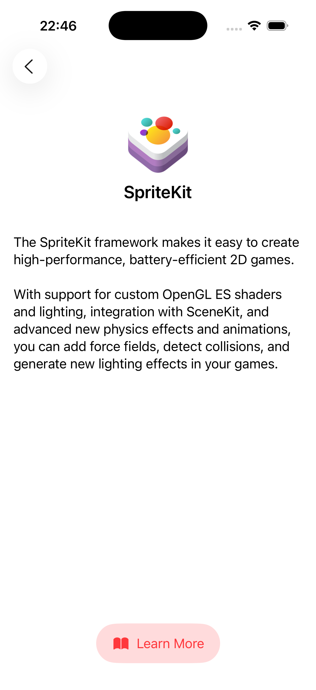

# Apple Frameworks App

A simple iOS app built with **SwiftUI** while learning the fundamentals of iOS development.  
The app displays a grid of Apple frameworks. Tapping on a framework shows a short description, and users can open the official Apple documentation to learn more.

---

## 📱 Screenshots

### Home Screen

### Detail Screen

### External Documentation

---

## ✨ Features
- Display Apple frameworks in a **grid layout**.
- Tap on a framework to see **detailed information**.
- "Learn More" button that opens the **official Apple Developer documentation** inside Safari.
- Clean and minimal **SwiftUI design** with reusable components.

---

## 🛠️ Tech Stack
- **Swift**
- **SwiftUI**
- **MVVM (basic usage)**

---

## 🎯 Learning Outcomes
While building this project, I learned:
- Structuring and composing **SwiftUI views**.
- Using **LazyVGrid** for responsive grid-based layouts.
- Basics of **MVVM architecture** in SwiftUI.
- Implementing **navigation** between list and detail views.
- Opening **external links** in iOS apps.
- Designing reusable UI elements like buttons and cards.

---
